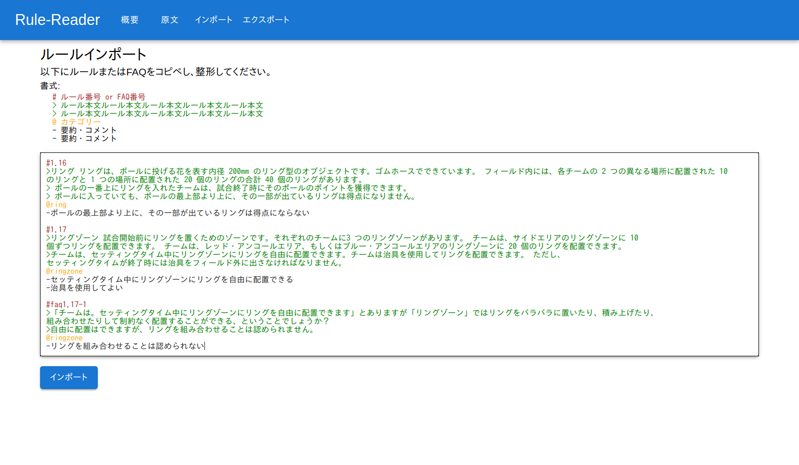
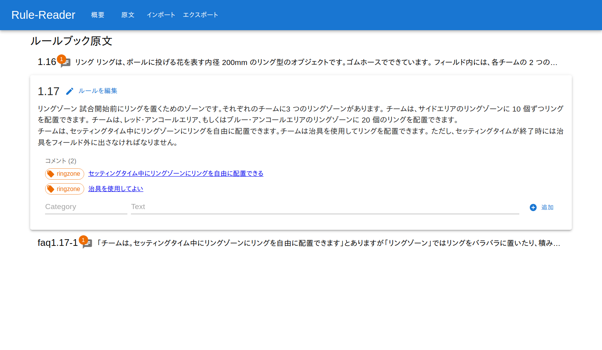
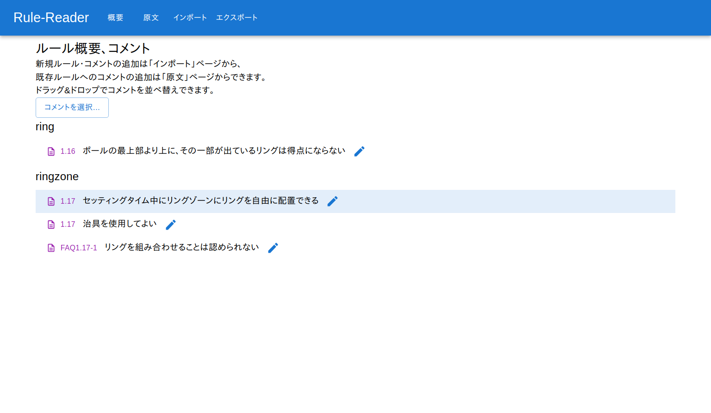

# Robocon Rule Reader

ルールブック・FAQを管理するアプリ

ルールやFAQの原文1文ごとに要約やコメントを書き、カテゴリごとに分類して表示することができます

## usage
(READMEのスクショは古いです)

1. まず「インポート」にルール文やFAQをコピペし、ルールごとに改行を入れたりルール番号の見出しをつけたりします。さらにここでカテゴリーとコメント(詳細は後述)を書くこともできます(後からでも書ける)。かけたらインポートボタンを押して完了

2. そうすると「原文」ページに入力したルール文が表示されます。ここでそのルール文にコメントを追加することもできます。コメントはそのルール文をかんたんに要約したものとか、特に後で議論になりそうなところを抽出したものというイメージです

3. コメントを追加すると「概要」ページに表示されます。概要ページと原文ページはそれぞれクリックすることで対応するものに相互に飛べます。


## deploy

環境変数か.envファイルに`DATABASE_URL="postgres://..."`を設定して
```bash
npm install
npx prisma db push
npm run build
npm run start
```

