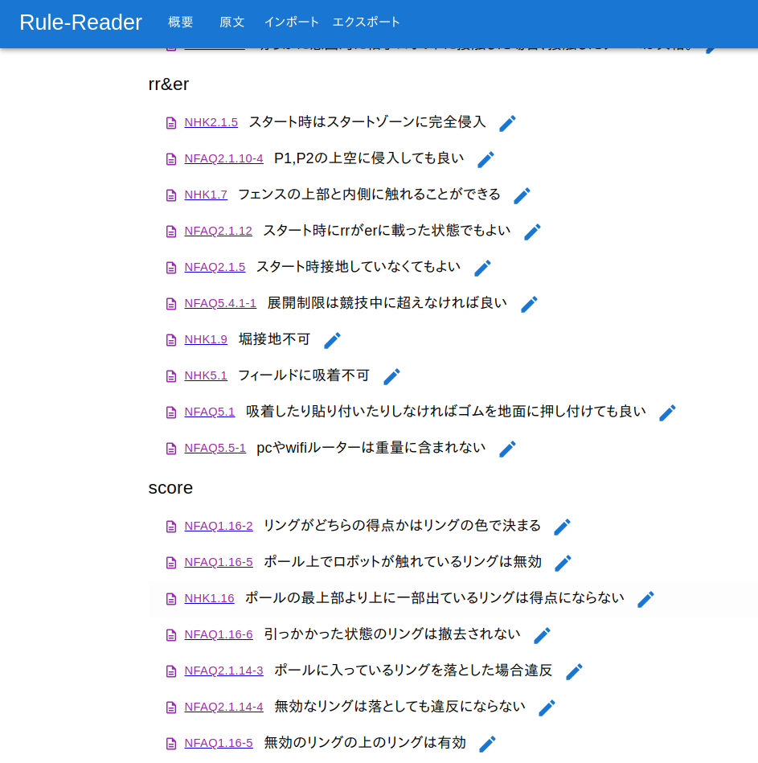

# Robocon Rule Reader

ルールブック・FAQを管理するアプリ

ルールやFAQの原文1文ごとに要約やコメントを書き、カテゴリごとに分類して表示することができます



## deploy

環境変数か.envファイルに`DATABASE_URL="postgres://..."`を設定して
```bash
npm install
npx prisma db push
npm run build
npm run start
```

